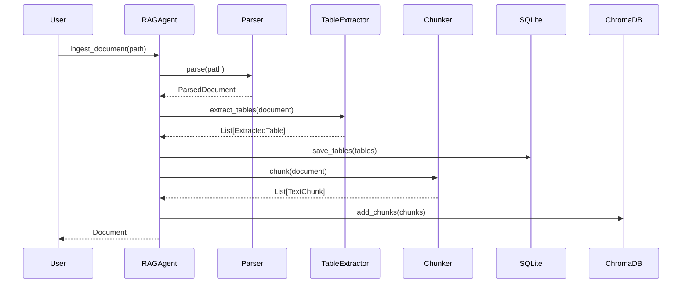
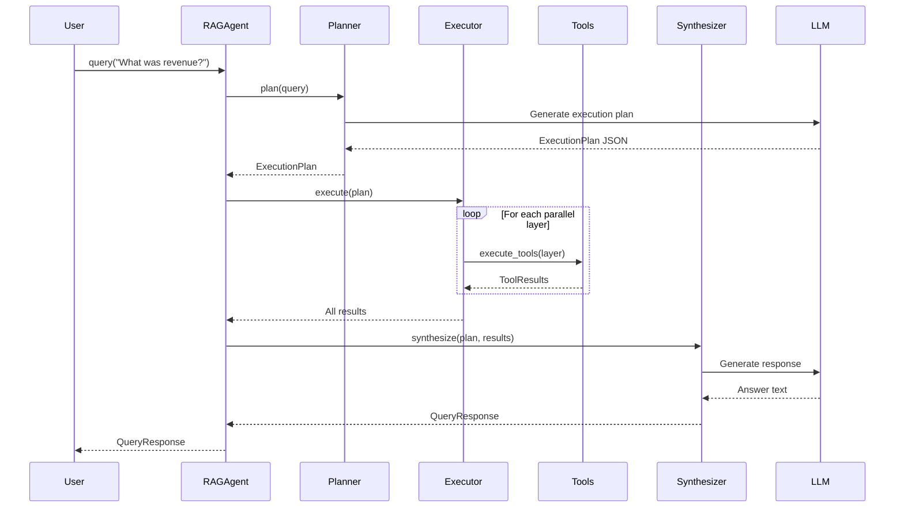

# UltimateRAG - Technical Overview

A comprehensive technical document covering the architecture, components, and implementation details of the UltimateRAG financial document analysis system.

---

## Table of Contents

1. [System Architecture](#system-architecture)
2. [Core Components](#core-components)
3. [Data Flow](#data-flow)
4. [Storage Layer](#storage-layer)
5. [Security Architecture](#security-architecture)
6. [API & Interfaces](#api--interfaces)
7. [Configuration](#configuration)
8. [Performance Characteristics](#performance-characteristics)

---

## System Architecture

```mermaid
flowchart TB
    subgraph Input["📥 Input Layer"]
        PDF[PDF Documents]
        XLSX[Excel/CSV Files]
    end
    
    subgraph Ingestion["🔄 Ingestion Pipeline"]
        Parser[Document Parser]
        TableExt[Table Extractor]
        Chunker[Text Chunker]
        Embedder[Embedding Generator]
    end
    
    subgraph Storage["💾 Storage Layer"]
        SQLite[(SQLite DB)]
        ChromaDB[(ChromaDB)]
        DocStore[(Document Store)]
    end
    
    subgraph Agent["🤖 RAG Agent"]
        Planner[Query Planner]
        Executor[Parallel Executor]
        Synth[Response Synthesizer]
    end
    
    subgraph Tools["🔧 Tool Layer"]
        SQLTool[SQL Query]
        VectorTool[Vector Search]
        CalcTool[Calculator]
        DocTool[Get Document]
    end
    
    subgraph LLM["☁️ LLM Providers"]
        OpenRouter[OpenRouter]
        OpenAI[OpenAI]
        Anthropic[Anthropic]
    end
    
    PDF --> Parser
    XLSX --> Parser
    Parser --> TableExt
    Parser --> Chunker
    TableExt --> SQLite
    Chunker --> Embedder
    Embedder --> ChromaDB
    Parser --> DocStore
    
    Planner --> Executor
    Executor --> Tools
    SQLTool --> SQLite
    VectorTool --> ChromaDB
    DocTool --> DocStore
    Tools --> Synth
    
    Planner --> LLM
    Synth --> LLM
</mermaid>
```

### High-Level Flow

1. **Ingestion**: Documents are parsed, tables extracted, text chunked, and embeddings generated
2. **Query Planning**: User query is decomposed into a DAG of tool calls by the LLM
3. **Parallel Execution**: Independent tool calls execute concurrently
4. **Synthesis**: Results are combined into a coherent response with citations

---

## Core Components

### 1. RAG Agent (`src/rag_agent.py`)

The central orchestrator that coordinates all components.

```python
class RAGAgent:
    """Core orchestrator for document ingestion and querying."""
    
    async def ingest_document(path: Path) -> Document
    async def query(query: str, verbose: bool) -> QueryResponse
    def get_stats() -> dict
```

**Key Features:**
- Async/await for concurrent operations
- Supports both PDF and spreadsheet ingestion
- Automatic table extraction and schema detection

---

### 2. Query Planner (`src/agent/planner.py`)

Decomposes natural language queries into executable tool call DAGs.

```python
class Planner:
    async def plan(query: str) -> ExecutionPlan
```

**Output Structure:**
```json
{
  "query": "What was revenue in 2024?",
  "reasoning": "Need to search for revenue data",
  "steps": [
    {"id": "step_1", "tool": "vector_search", "input": "revenue 2024", "depends_on": []}
  ]
}
```

---

### 3. Tool System (`src/tools/`)

| Tool | Purpose | Input | Output |
|------|---------|-------|--------|
| `sql_query` | Query structured tables | Natural language | SQL results |
| `vector_search` | Semantic document search | Search query | Relevant chunks |
| `calculator` | Safe math evaluation | Expression | Numeric result |
| `get_document` | Retrieve full documents | Document ID | Document content |

**Tool Interface:**
```python
class Tool(ABC):
    @property
    def name(self) -> ToolName
    
    async def execute(self, input: str, context: dict) -> Any
```

---

### 4. Response Synthesizer (`src/agent/synthesizer.py`)

Combines tool results into coherent, cited responses.

```python
class ResponseSynthesizer:
    async def synthesize(plan: ExecutionPlan, results: dict) -> QueryResponse
```

**Output includes:**
- Professional financial analyst formatting
- Source citations with page/line numbers
- Calculation step documentation

---

## Data Flow

### Ingestion Pipeline



### Query Pipeline



---

## Storage Layer

### 1. SQLite Store (`src/storage/sqlite_store.py`)

**Purpose:** Structured data from extracted tables

**Tables:**
| Table | Purpose |
|-------|---------|
| `documents` | Document metadata |
| `extracted_tables` | Table schemas and metadata |
| `table_data` | Key-value table rows |
| `spreadsheet_tables` | Native spreadsheet data |
| `[dynamic]` | Extracted tables as native SQL |

**Security:**
- `validate_sql_query()` - SELECT-only, forbidden keyword blocking
- `add_limit_clause()` - Automatic LIMIT 10000 on queries
- `SecurityError` exception for violations

---

### 2. ChromaDB Store (`src/storage/chroma_store.py`)

**Purpose:** Vector embeddings for semantic search

**Configuration:**
```python
ChromaSettings(
    collection_name="rag_chunks",
    embedding_function=OpenRouterEmbeddings(),
    distance_metric="cosine"
)
```

**Features:**
- Reranking with cross-encoder (`ms-marco-MiniLM-L-6-v2`)
- Batch operations for efficient indexing
- Metadata filtering support

---

### 3. Document Store (`src/storage/document_store.py`)

**Purpose:** Full document content and metadata

**Structure:**
```
data/documents/
├── .metadata/          # JSON metadata files
│   └── {doc_id}.json
├── .content/           # Extracted text
│   └── {doc_id}.txt
└── {filename}          # Original files
```

**Security:**
- `secure_path_join()` - Path traversal protection
- `validate_document_id()` - Safe ID format enforcement

---

## Security Architecture

### Defense Layers

```mermaid
flowchart LR
    subgraph Input["Input Validation"]
        QueryLen[Query Length Limit]
        FileSize[File Size Limit]
        PathVal[Path Validation]
    end
    
    subgraph Prompt["Prompt Security"]
        Sanitize[Input Sanitization]
        Wrap[Content Wrapping]
        Detect[Injection Detection]
    end
    
    subgraph SQL["SQL Security"]
        Validate[SQL Validation]
        Forbid[Keyword Blocking]
        Limit[Auto LIMIT]
    end
    
    subgraph Runtime["Runtime Protection"]
        Depth[AST Depth Limit]
        Props[Property-based Keys]
        Logging[Secure Logging]
    end
    
    Input --> Prompt --> SQL --> Runtime
```



### Security Controls Summary

| Control | Location | Protection |
|---------|----------|------------|
| SQL Validation | `sqlite_store.py` | Injection prevention |
| Input Sanitization | `security.py` | Prompt injection |
| Path Security | `document_store.py` | Directory traversal |
| API Key Properties | `config.py` | Key exposure prevention |
| Depth Limiting | `calculator.py` | DoS prevention |
| Query Limits | `query.py`, `ingest.py` | Resource exhaustion |

---

## API & Interfaces

### CLI Scripts

#### Query (`scripts/query.py`)
```bash
# Interactive mode
python scripts/query.py

# Single query
python scripts/query.py "What was revenue in 2024?"

# With model selection
python scripts/query.py -m gpt-4o "Complex query"

# Export results
python scripts/query.py -o results.csv "Query"
python scripts/query.py -o report.pdf "Query"
```

#### Ingest (`scripts/ingest.py`)
```bash
# Single file
python scripts/ingest.py document.pdf

# Folder
python scripts/ingest.py -f ./reports

# Pattern matching
python scripts/ingest.py -f ./data --pattern "*.xlsx"
```

### Programmatic API

```python
from src.rag_agent import RAGAgent
from src.llm_client import get_llm_client

# Initialize
llm = get_llm_client()
agent = RAGAgent(llm_client=llm)

# Ingest
doc = await agent.ingest_document(Path("report.pdf"))

# Query
response = await agent.query("What was net income?")
print(response.answer)
print(response.citations)
```

---

## Configuration

### Environment Variables

```bash
# LLM Providers (at least one required)
OPENROUTER_API_KEY=sk-or-...
OPENAI_API_KEY=sk-...
ANTHROPIC_API_KEY=sk-ant-...

# Model Selection
LLM_MODEL=google/gemini-3-flash-preview
VISION_MODEL=google/gemini-3-flash-preview
EMBEDDING_MODEL=qwen/qwen3-embedding-8b

# Feature Flags
USE_VISION_TABLES=true
EMBEDDING_PROVIDER=auto  # auto, openrouter, local
```

### Configuration Class (`src/config.py`)

```python
@dataclass
class Config:
    # Paths
    base_dir: Path
    data_dir: Path
    sqlite_path: Path
    chroma_path: Path
    
    # Models
    llm_model: str = "google/gemini-3-flash-preview"
    vision_model: str = "google/gemini-3-flash-preview"
    
    # Security (properties, not stored)
    @property
    def openrouter_api_key(self) -> str | None
```

---

## Performance Characteristics

### Benchmarks

| Operation | Typical Time | Notes |
|-----------|--------------|-------|
| PDF Ingestion | 30-60s | Depends on page count, tables |
| Spreadsheet Ingestion | 5-15s | Per sheet |
| Simple Query | 3-5s | Single vector search |
| Complex Query | 5-10s | Multiple tools, parallel execution |
| SQL Query | <100ms | After LLM SQL generation |

### Optimization Features

1. **Parallel Execution**: Independent tool calls run concurrently
2. **Reranking**: Cross-encoder reranking for +25% precision
3. **Native SQL Tables**: Direct SQL queries on extracted data
4. **Batch Embeddings**: Bulk embedding generation
5. **Cached Document Names**: Avoid repeated lookups

### Resource Requirements

| Resource | Minimum | Recommended |
|----------|---------|-------------|
| RAM | 4GB | 8GB+ |
| Disk | 1GB + docs | 5GB+ |
| Python | 3.11+ | 3.12 |
| GPU | Not required | Optional (local embeddings) |

---

## File Structure

```
ultimateRAG/
├── src/
│   ├── __init__.py
│   ├── config.py              # Configuration management
│   ├── security.py            # Security utilities
│   ├── models.py              # Pydantic models
│   ├── llm_client.py          # LLM provider abstraction
│   ├── embeddings.py          # Embedding generation
│   ├── rag_agent.py           # Main orchestrator
│   ├── agent/
│   │   ├── planner.py         # Query planning
│   │   ├── executor.py        # Parallel execution
│   │   └── synthesizer.py     # Response synthesis
│   ├── tools/
│   │   ├── base.py            # Tool interface
│   │   ├── sql_query.py       # SQL tool
│   │   ├── vector_search.py   # Search tool
│   │   ├── calculator.py      # Math tool
│   │   └── get_document.py    # Document tool
│   ├── storage/
│   │   ├── sqlite_store.py    # Structured storage
│   │   ├── chroma_store.py    # Vector storage
│   │   └── document_store.py  # File storage
│   └── ingestion/
│       ├── pdf_parser.py      # PDF parsing
│       ├── spreadsheet_parser.py
│       ├── table_extractor.py
│       ├── vision_table_extractor.py
│       ├── chunker.py         # Text chunking
│       └── schema_detector.py
├── scripts/
│   ├── query.py               # Query CLI
│   └── ingest.py              # Ingestion CLI
├── tests/
│   ├── test_sql_security.py
│   └── test_prompt_injection.py
├── data/                      # Generated data directory
│   ├── documents/
│   └── db/
├── requirements.txt
├── pyproject.toml
└── README.md
```

---

## Dependencies

### Core
- `pydantic` - Data validation
- `chromadb` - Vector database
- `pdfplumber` - PDF parsing
- `pandas` / `openpyxl` - Spreadsheet handling
- `aiohttp` - Async HTTP

### LLM Integration
- `openai` - OpenAI/OpenRouter client
- `anthropic` - Claude client
- `sentence-transformers` - Local embeddings

### Performance
- `flashrank` - Fast reranking
- `thepipe` - Vision-based extraction

---

*Document Version: 1.0 | Last Updated: December 22, 2025*
