# Finance RAG - Technical Overview

A comprehensive technical document covering the architecture, components, and implementation details of the Finance RAG financial document analysis system.

---

## Table of Contents

1. [System Architecture](#system-architecture)
2. [Core Components](#core-components)
3. [Audit Transparency Architecture](#audit-transparency-architecture)
4. [Data Flow](#data-flow)
5. [Storage Layer](#storage-layer)
6. [Schema Clustering](#schema-clustering)
7. [Ingestion Pipeline](#ingestion-pipeline)
8. [Security Architecture](#security-architecture)
9. [API & Interfaces](#api--interfaces)
10. [Configuration](#configuration)
11. [Performance Characteristics](#performance-characteristics)
12. [Testing](#testing)
13. [File Structure](#file-structure)
14. [Dependencies](#dependencies)

---

## System Architecture


### High-Level Flow

1. **Ingestion**: Documents are parsed, tables extracted (VLM → Docling → rule-based), text chunked, schemas enhanced, temporal metadata extracted, and everything stored across three backends
2. **Schema Clustering**: Extracted tables are assigned to company-domain clusters for scalable LLM context
3. **Query Planning**: User query is decomposed into a DAG of tool calls (LLM-planned, heuristic, or fast-path)
4. **Parallel Execution**: Independent tool calls execute concurrently with per-step timing via `ExecutionMonitor`
5. **Synthesis**: Results are combined into a coherent response with citations, calculation transcripts, or structured refusals

---

## Core Components

### 1. RAG Agent (`src/rag_agent.py`)

The central orchestrator that coordinates all components.

```python
class RAGAgent:
    """Core orchestrator for document ingestion and querying."""

    SPREADSHEET_SAMPLE_ROWS = 25  # Rows included in vector search text chunks

    def __init__(self, llm_client: Any = None)

    async def ingest_document(path: Path) -> Document | list[Document]
    async def query(query: str, verbose: bool = False) -> QueryResponse
    def get_stats() -> dict
```

**Key Features:**
- Async/await for concurrent operations
- Returns `Document` for PDFs, `list[Document]` for multi-sheet spreadsheets
- `asyncio.Semaphore(10)` for concurrent table schema enhancement
- `SchemaClusterManager` integration with LLM-powered company learning
- `learn_company_from_document()` called during ingestion to populate company registry
- `assign_table()` called for each extracted table with LLM domain classification
- Three-tier table extraction: VLM → Docling → Rule-based
- `query_documents()` async helper and `query_sync()` sync wrapper

---

### 2. Query Planner (`src/agent/planner.py`)

Decomposes natural language queries into executable tool call DAGs.

```python
class Planner:
    def __init__(self, llm_client, sqlite_store)

    async def create_plan(
        query: str,
        available_tables: list[str] | None = None,
        available_documents: list[str] | None = None,
        skip_llm: bool = False
    ) -> ExecutionPlan
```

**Three Planning Paths:**

| Path | When Used | Description |
|------|-----------|-------------|
| **Fast-path** | Simple single-entity queries | `_create_fast_plan()` — parallel vector_search + optional SQL |
| **LLM planning** | Complex queries (comparisons, calculations, multi-company) | `_plan_with_llm()` — full DAG with dependencies |
| **Heuristics** | No LLM available | `_create_heuristic_plan()` — rule-based fallback |

**Complexity Detection (`_is_simple_query()`):**
- Uses `CompanyRegistry` for dynamic company detection
- Complex triggers: calculations, comparisons, multi-company, time-series, aggregations
- Simple: direct lookups, single-entity questions

**Planning Prompt Features:**
- 100+ line financial analyst system prompt
- Explicit SECURITY NOTICE for untrusted input handling
- Tool descriptions with use cases and examples
- Optimization guidance for parallel execution
- Arithmetic prohibition enforcement

**Security Integration:**
- `detect_injection_attempt()` called with logging before LLM planning
- `sanitize_user_input()` and `wrap_user_content()` applied to query

**Output Structure:**
```json
{
  "query": "Compare NVIDIA and AMD revenue in 2024",
  "reasoning": "Need parallel lookups for both companies, then comparison",
  "steps": [
    {"id": "step_1", "tool": "vector_search", "input": "NVIDIA revenue 2024", "depends_on": []},
    {"id": "step_2", "tool": "vector_search", "input": "AMD revenue 2024", "depends_on": []},
    {"id": "step_3", "tool": "calculator", "input": "{step_1.revenue} - {step_2.revenue}", "depends_on": ["step_1", "step_2"]}
  ]
}
```

---

### 3. Tool System (`src/tools/`)

| Tool | Purpose | Input | Output |
|------|---------|-------|--------|
| `sql_query` | Query structured tables | Natural language | `SQLQueryResult` |
| `vector_search` | Semantic document search | Search query | Ranked chunks with metadata |
| `calculator` | Safe math with audit transcripts | Expression with `{step_id}` refs | `CalculationTranscript` |
| `get_document` | Retrieve full documents | Document ID (optionally `doc_id:section`) | Document content |

**Tool Base Class (`src/tools/base.py`):**
```python
class Tool(ABC):
    @property
    def name(self) -> ToolName

    @abstractmethod
    async def execute(self, input: str, context: dict) -> Any

    async def run(self, input: str, context: dict) -> ToolResult
        """Wrapper that times execution, catches exceptions, returns ToolResult."""
```

**SQL Query Tool (`src/tools/sql_query.py`):**
- `SchemaClusterManager` integration for focused schema context
- `get_schemas_for_query()` narrows LLM context to relevant companies/domains
- `LLM_TIMEOUT_SECONDS = 30` with `asyncio.wait_for()`
- Result formatting: scalar for single value, dict for single row, array for multiple rows
- Heuristic SQL generation when LLM unavailable

**Vector Search Tool (`src/tools/vector_search.py`):**
- Retrieval multiplier: `n_results * 3` candidates for reranking
- Reranker weighting: `vector_weight=0.3` (30% vector, 70% cross-encoder)
- Score thresholds: `min_score = 0.2` with reranking, `0.3` without
- Lazy reranker initialization with `_reranker_init_failed` tracking
- `search_sync()` for non-async contexts

**Reranker (`src/tools/reranker.py`):**
- Model: FlashRank (`cross-encoder/ms-marco-MiniLM-L-6-v2`)
- Lazy-loaded on first use (~10-50ms per query)
- Configurable on/off via `Config.use_reranking`
- ~25% precision improvement

**Calculator Tool (`src/tools/calculator.py`):**
- AST-based evaluation — never uses `eval()` or `exec()`
- `MAX_AST_DEPTH = 50` (DoS protection)
- 10 operators in `SAFE_OPERATORS` dict (add, sub, mul, div, floordiv, mod, pow, usub, uadd, bitxor)
- `_resolve_references_with_bindings()` returns `(resolved_expr, bindings_list)`
- `_infer_formula_description()` detects "Difference", "Margin Calculation", "Percentage", etc.
- `ComparabilityError` exception with `to_refusal()` method → converts to structured `QueryRefusal`
- `calculate()` async convenience function

**Get Document Tool (`src/tools/get_document.py`):**
- Document ID validation: `VALID_DOC_ID_PATTERN = r'^[a-zA-Z0-9_-]+$'`
- Section retrieval via `"doc_id:section_name"` format
- `list_documents()` method for metadata summaries

**Comparability Checker (`src/tools/comparability.py`):**
- `check_field_comparability(field_a, field_b)` → `ComparabilityResult`
- `create_comparability_refusal(result)` → `QueryRefusal`
- `validate_operands_comparable(operands)` → pairwise checking for first incompatibility
- Checks: accounting standard, currency, segment scope, definition similarity
- Confidence scoring: ≥0.8 comparable, 0.5–0.8 with warnings, <0.5 refuses

---

### 4. Response Synthesizer (`src/agent/synthesizer.py`)

Combines tool results into coherent, cited responses.

```python
class ResponseSynthesizer:
    async def synthesize(plan: ExecutionPlan, results: dict) -> QueryResponse
```

**Two Synthesis Modes:**

| Mode | When Used | Description |
|------|-----------|-------------|
| **LLM Synthesis** | LLM available | `_synthesize_with_llm()` — financial analyst formatting |
| **Template Synthesis** | No LLM | `_synthesize_with_template()` — structured result formatting by tool type |

**Features:**
- `sanitize_user_input()` and `wrap_user_content()` applied to query before LLM
- Document name caching via `_doc_name_cache` to avoid repeated lookups
- `CalculationTranscript.format_for_display()` for audit trail formatting
- `QueryRefusal.format_for_display()` — refusals treated as success mode
- Spreadsheet-specific citation formatting (Sheet: X, Rows Y-Z vs p.X, L.Y-Z)

**Synthesis Prompt:**
- 80+ line financial analyst guidelines
- CRITICAL: arithmetic prohibition section
- Citation formatting rules with page/line references
- Professional standards (GAAP/non-GAAP labeling, units, periods)

---

### 5. Execution Monitor (`src/agent/executor.py`)

```python
class DAGExecutor:
    """Parallel DAG execution engine with dependency resolution."""

class ExecutionMonitor:
    """Provides per-step, per-layer, and total timing."""
    async def execute_with_monitoring(plan: ExecutionPlan) -> dict
```

**DAG Execution:**
- Groups steps into parallelizable layers by dependency analysis
- Executes each layer concurrently via `asyncio.gather`
- Reference resolution: regex-based `{step_id}` or `{step_id.field.subfield}` with nested navigation
- Special handling for `CalculationTranscript`: extracts numeric `.result` for downstream references
- Individual step failures don't abort entire plan

---

## Audit Transparency Architecture

The system implements four layers of audit transparency to ensure calculations are verifiable and data quality issues are surfaced.

### 1. Operand Binding Visibility

Every calculation produces a `CalculationTranscript` showing the provenance of each value:

```python
class CalculationTranscript(BaseModel):
    original_expression: str      # "{step_1.revenue} - {step_2.revenue}"
    bindings: list[OperandBinding] # Source for each value
    resolved_expression: str      # "145600000000 - 128695000000"
    result: float                 # 16905000000.0
    formula_description: str      # "Difference" (auto-inferred)
```

**Example Output (via `format_for_display()`):**
```
**Calculation:** Difference
  • {step_1.revenue}: $145.60B (SQL query: revenue from step_1)
  • {step_2.revenue}: $128.69B (SQL query: revenue from step_2)
  • Expression: `145600000000.0 - 128695000000.0`
  • **Result:** $16.91B
```

### 2. Computation Enforcement

The LLM is explicitly prohibited from performing arithmetic. All math must come from the calculator tool:

```
CRITICAL: ARITHMETIC PROHIBITION
• ALL arithmetic operations MUST come from calculator tool results
• You may EXPLAIN calculations but NEVER perform them yourself
• Quote numbers EXACTLY as they appear in research findings
```

### 3. Refusal as Success Mode

When data quality or comparability issues arise, the system refuses gracefully:

```python
class QueryRefusal(BaseModel):
    reason: RefusalReason
    explanation: str
    what_was_found: str
    what_is_missing: list[str]
    suggested_alternatives: list[str]

    def format_for_display(self) -> str
```

**Refusal Reasons (`RefusalReason` enum):**

| Reason | Description |
|--------|-------------|
| `DEFINITION_MISMATCH` | Comparing incompatible metric definitions |
| `INSUFFICIENT_DATA` | Required data not available in knowledge base |
| `PERIOD_DISCONTINUITY` | Time periods don't align for comparison |
| `INCOMPARABLE_METRICS` | Different standards (GAAP vs non-GAAP) |
| `MISSING_CONTEXT` | Need more information to answer reliably |

### 4. Definition Hashing / Versioning

Field definitions are tracked with semantic hashes for comparability:

```python
class FieldDefinition(BaseModel):
    field_name: str
    definition_hash: str           # SHA256 for quick matching
    accounting_standard: AccountingStandard  # GAAP, NON_GAAP, IFRS, UNKNOWN
    segment_scope: str             # "Consolidated", "North America"
    currency: str                  # "USD", "EUR"
    excludes_items: list[str]      # "one-time items"

class AccountingStandard(str, Enum):
    UNKNOWN = "unknown"
    GAAP = "gaap"
    NON_GAAP = "non_gaap"
    IFRS = "ifrs"
```

```python
result = ComparabilityResult.check_comparability(field_a, field_b)
# Returns: comparable=False, differences=["Accounting standards differ: gaap vs non_gaap"]
```

---

## Data Flow

### Ingestion Pipeline


### Query Pipeline


---

## Storage Layer

### 1. SQLite Store (`src/storage/sqlite_store.py`)

**Purpose:** Structured data from extracted tables

**Tables:**
| Table | Purpose |
|-------|---------|
| `documents` | Document metadata (id, filename, file_type, page_count, ingested_at) |
| `extracted_tables` | Table schemas, metadata, row counts |
| `table_data` | Key-value table rows (EAV format) |
| `spreadsheet_tables` | Native spreadsheet data via `save_spreadsheet_native()` |
| `[dynamic]` | One per extracted/spreadsheet table (e.g., `nvidia_revenue_2024`) |

**Security:**
- `validate_sql_query()` — SELECT-only enforcement
- `FORBIDDEN_SQL_KEYWORDS` — 18 keywords: `DROP`, `DELETE`, `INSERT`, `UPDATE`, `ALTER`, `CREATE`, `TRUNCATE`, `EXEC`, `EXECUTE`, `GRANT`, `REVOKE`, `ATTACH`, `DETACH`, `PRAGMA`, `VACUUM`, `REINDEX`, `REPLACE`, `MERGE`
- Word-boundary regex matching: `rf'\b{keyword}\b'` (avoids false positives)
- Multiple statement prevention: `;` character validation
- SQL comment injection blocked: `--` and `/*` patterns forbidden
- `validate_identifier()`: `^[a-zA-Z_][a-zA-Z0-9_]*$` pattern, max 63 chars
- `MAX_SQL_RESULT_ROWS = 10000` — automatic `LIMIT` on all queries
- `SecurityError` exception for violations

---

### 2. ChromaDB Store (`src/storage/chroma_store.py`)

**Purpose:** Vector embeddings for semantic search

**Configuration:**
```python
ChromaSettings(
    collection_name="documents",
    distance_metric="cosine",
    hnsw_params={
        "hnsw:M": 32,                  # Increased from 16 for better recall
        "hnsw:construction_ef": 200,
        "hnsw:search_ef": 100
    }
)
```

**Embedding Providers (auto-detected):**

| Provider | Model | Size | When Used |
|----------|-------|------|-----------|
| **OpenRouter** (preferred) | `qwen/qwen3-embedding-8b` | Remote | `OPENROUTER_API_KEY` available |
| **Local** (fallback) | `BAAI/bge-small-en-v1.5` | 133MB | No API key configured |

- `ChromaEmbeddingFunction` custom wrapper for Chroma integration
- Thread-safe lazy initialization with double-checked locking
- Batch operations for efficient indexing
- Metadata filtering support

---

### 3. Document Store (`src/storage/document_store.py`)

**Purpose:** Full document content and metadata

**Structure:**
```
data/documents/
├── .metadata/          # JSON metadata files
│   └── {doc_id}.json
├── .content/           # Extracted text
│   └── {doc_id}.txt
└── {filename}          # Original files
```

**Security:**
- `secure_path_join()` — path traversal protection using `.resolve()` canonicalization
- Verifies resolved path is within base directory
- Null byte check: `'\x00' in safe_name`
- Traversal pattern removal: `'..'` replaced with `'_'`
- Strict filename sanitization: `r'^[\w\-. ]+$'` (alphanumeric, underscore, hyphen, dot, space)
- `validate_document_id()` — safe ID format enforcement

---

## Schema Clustering

### Schema Cluster Manager (`src/storage/schema_cluster.py`)

**Purpose:** Organize table schemas hierarchically by company and domain for scalable LLM context. Without clustering, every SQL generation prompt would include all table schemas, consuming excessive tokens.

**Hierarchy:** Company → Domain → Table

**Pre-Defined Domains:**

| Domain | Keywords | Priority | Description |
|--------|----------|----------|-------------|
| `financial_statements` | revenue, income, balance, cash flow | 10 | Core financial statements |
| `stock_market` | stock, share, price, dividend | 8 | Stock market data |
| `performance_metrics` | margin, growth, ratio, eps | 7 | KPI and performance metrics |
| `segment_data` | segment, region, geography | 6 | Business segment data |
| `quarterly_data` | q1, q2, q3, q4, quarter | 5 | Quarterly breakdowns |
| `general` | — | 0 | Default catch-all |

Each domain has `domain_id`, `name`, `keywords` set, `description`, and `priority` (0–10).

**Key Classes:**

```python
class CompanyRegistry:
    """Dynamic company learning with LLM extraction."""
    def learn_company_from_document(filename: str) -> str | None
    def detect_companies_in_query(query: str) -> list[str]

class SchemaClusterManager:
    """Manages company-domain table clusters."""
    def __init__(self, llm_client=None)

    async def learn_company_from_document(filename: str) -> str | None
    async def classify_table_with_llm(table_name: str, headers: list[str]) -> tuple[str, str]
    def assign_table(table_name: str, company: str, domain: str)
    def get_schemas_for_query(query: str) -> dict
```

**Fallback:** `_classify_with_heuristics()` used when LLM unavailable — keyword matching against domain keyword sets.

**Benefits:**
- Entity isolation (NVIDIA tables separate from AMD tables)
- Reduced LLM prompt size (only relevant schemas included)
- Semantic grouping (related tables discovered together)
- Scales linearly with document count

---

## Ingestion Pipeline

### Table Extraction (Three-Tier Strategy)


**VLM Extractor (`src/ingestion/vlm_extractor.py`):**
- Default model: `google/gemini-2.5-flash-lite`
- API: OpenRouter (`https://openrouter.ai/api/v1/chat/completions`)
- Concurrency: `asyncio.Semaphore(20)`
- Max tables: 100 per document
- Renders PDF pages as images via PyMuPDF, sends to vision model
- Returns structured JSON with headers and rows

**Docling Extractor (`src/ingestion/vision_table_extractor.py`):**
- Class: `VisionTableExtractor`
- Mode: `TableFormerMode.FAST` (4x faster than ACCURATE)
- Acceleration: `AcceleratorDevice.AUTO` (MPS on Mac, CUDA on Linux)
- OCR: disabled (`do_ocr=False`) for digital PDFs
- Image generation: disabled for optimization
- Runs entirely locally — no API calls

**Rule-Based Extractor (`src/ingestion/table_extractor.py`):**
- Regex-based tabular pattern detection
- Parses aligned whitespace and delimiters
- Always available — no external dependencies

### PDF Parsing (`src/ingestion/pdf_parser.py`)

```python
@dataclass
class ParsedPage:
    page_number: int
    text: str
    start_line_offset: int   # Cumulative line tracking

@dataclass
class ParsedPDF:
    pages: list[ParsedPage]
    metadata: dict
```

- Extracts full text per page via pdfplumber (lazy-loaded)
- Preserves page numbers and cumulative line offsets
- Handles multi-column layouts

### Spreadsheet Parsing (`src/ingestion/spreadsheet_parser.py`)

```python
@dataclass
class ParsedSheet:
    name: str
    headers: list[str]
    rows: list[list]
    row_count: int
    col_count: int
    dataframe: Any = None     # Native DataFrame for SQL insertion

@dataclass
class ParsedSpreadsheet:
    sheets: list[ParsedSheet]
    filename: str
```

- **Excel:** reads all sheets via pandas + openpyxl
- **CSV:** reads as single sheet via pandas
- Each sheet produces:
  - A native SQL table via `save_spreadsheet_native()` (direct column queries)
  - A text chunk with first `SPREADSHEET_SAMPLE_ROWS` (25) rows for vector search
- Metadata: row count, column count, header names, sheet name

### Schema Detection (`src/ingestion/schema_detector.py`)

- LLM-powered schema enhancement with structured JSON output
- Prompt extracts: `table_name`, `table_description`, `column_mappings`, `temporal_context`
- Detects column names that are actually header values (e.g., "27_414")
- Temporal context extraction: fiscal year, quarter, period type
- Concurrency controlled via `asyncio.Semaphore(10)` in RAG agent

### Temporal Extraction (`src/ingestion/temporal_extractor.py`)

```python
def extract_temporal_metadata(filename: str, text: str = None) -> TemporalMetadata
```

- 3 fiscal quarter patterns, 3 report type categories
- Report types: `annual` (`10-K`, yearly), `quarterly` (`10-Q`, quarterly), `earnings`
- Negative lookahead: `(?!\d)` prevents "10-K1" matching as "10-K"
- Filename patterns take priority over content patterns

### Text Chunking (`src/ingestion/chunker.py`)

```python
@dataclass
class ChunkingConfig:
    max_chunk_size: int = 500    # tokens
    chunk_overlap: int = 50      # tokens
    min_chunk_size: int = 50     # tokens
```

- Token approximation: `max_words = int(max_chunk_size / 1.3)`
- Splits on paragraph boundaries (double newlines)
- Maintains overlap between adjacent chunks for context continuity
- Metadata preserved: page number, section title, `start_line`, `end_line`
- Skips chunks below minimum size threshold

---

## Security Architecture

### Defense Layers

```mermaid
flowchart LR
    subgraph Input["Input Validation"]
        QueryLen["Query Length\n≤5000 chars"]
        FileSize["File Size\n≤500MB"]
        PathVal["Path Validation\nNo .., \\x00"]
    end

    subgraph Prompt["Prompt Security"]
        Sanitize["Sanitize Input\nEscape {}, remove control chars"]
        Wrap["Content Wrapping\n<user_query> delimiters"]
        Detect["Injection Detection\n16 regex patterns"]
    end

    subgraph SQL["SQL Security"]
        Validate["SELECT-only\nEnforcement"]
        Forbid["18 Forbidden\nKeywords"]
        Limit["Auto LIMIT\n10000 rows"]
        NoComment["Block SQL\nComments"]
    end

    subgraph Runtime["Runtime Protection"]
        Depth["AST Depth ≤50"]
        Props["Property-based\nAPI Keys"]
        DocID["Document ID\nValidation"]
    end

    Input --> Prompt --> SQL --> Runtime
```



### Security Controls Summary

| Control | Location | Protection | Details |
|---------|----------|------------|---------|
| Query length limit | `security.py` | Resource exhaustion | `MAX_QUERY_LENGTH = 5000` |
| Prompt content limit | `security.py` | Resource exhaustion | `MAX_PROMPT_CONTENT_LENGTH = 50000` |
| File size limit | `ingest.py` | Resource exhaustion | `MAX_FILE_SIZE_MB = 500` |
| Injection detection | `security.py` | Prompt injection | 16 regex patterns, logged not blocked |
| Input sanitization | `security.py` | Prompt injection | Escapes `{}`→`{{}}`, removes control chars (except `\n`, `\t`) |
| Content wrapping | `security.py` | Prompt injection | `wrap_user_content(content, label)` with clear delimiters |
| SQL validation | `sqlite_store.py` | SQL injection | SELECT-only, 18 forbidden keywords, word-boundary regex |
| Statement separation | `sqlite_store.py` | SQL injection | `;` blocked, `--` and `/*` blocked |
| Auto LIMIT | `sqlite_store.py` | DoS | `MAX_SQL_RESULT_ROWS = 10000` |
| Identifier validation | `sqlite_store.py` | SQL injection | `^[a-zA-Z_][a-zA-Z0-9_]*$`, max 63 chars |
| Path security | `document_store.py` | Directory traversal | `.resolve()` canonicalization, base dir check |
| Null byte check | `document_store.py` | Path traversal | `'\x00'` rejected |
| AST depth limiting | `calculator.py` | DoS | `MAX_AST_DEPTH = 50` |
| API key properties | `config.py` | Key exposure | Runtime properties, not stored in fields |
| Document ID validation | `get_document.py` | Injection | `^[a-zA-Z0-9_-]+$` regex |
| LLM timeout | `sql_query.py` | Hanging | `LLM_TIMEOUT_SECONDS = 30` |

### Prompt Injection Patterns (16 patterns)

Detected patterns include:
- `"ignore previous instructions"`
- `"disregard above"`
- `"you are now"` / `"your new role is"`
- `"act as if"`
- `"reveal your"` / `"show me your system prompt"`
- `"forget everything"`
- `"override your instructions"`
- And 7 additional patterns

**Mitigation:** Detection does NOT block the query (avoids false positive censorship). Patterns are logged and input is sanitized before use.

---

## API & Interfaces

### CLI Scripts

#### Query (`scripts/query.py`)
```bash
# Interactive REPL mode
python scripts/query.py

# Single query
python scripts/query.py "What was revenue in 2024?"

# With model selection
python scripts/query.py -m gpt-4o "Complex query"
python scripts/query.py -m claude-sonnet "Complex query"

# Export results
python scripts/query.py -o results.csv "Query"
python scripts/query.py -o report.pdf "Query"
python scripts/query.py -o data.json "Query"

# List available models
python scripts/query.py --list-models
```

**Features:**
- Interactive REPL with prompt and history
- Single-shot mode with exit code
- Model selection via `-m`/`--model` flag
- Output export: PDF (via fpdf2), CSV, JSON via `-o`/`--output` flag
- `detect_injection_attempt()` logged to `query.log`
- Rich UI: `print_header`, `print_answer`, `print_citations`, `print_stats_table`
- Execution timing display

#### Ingest (`scripts/ingest.py`)
```bash
# Single file
python scripts/ingest.py document.pdf

# Multiple files
python scripts/ingest.py doc1.pdf data.xlsx sheet.csv

# Folder
python scripts/ingest.py -f ./reports

# Pattern matching
python scripts/ingest.py -f ./data --pattern "*.xlsx"
```

**Features:**
- `MAX_FILE_SIZE_MB = 500` validation
- `validate_file_for_ingestion()` — extension check, path safety, file size
- `create_progress()` for Rich visual feedback
- Per-file success/failure reporting
- Summary statistics on completion

#### Analyst Evaluation (`scripts/analyst_evaluation.py`)
```bash
python scripts/analyst_evaluation.py
```

- Multi-document query evaluation suite
- `QueryResult` dataclass: query, response, timing, citations, accuracy notes
- Query categories: Cross-Company Comparisons, Multi-Factor Analysis
- Ground truth hints for validation

### Programmatic API

```python
from src.rag_agent import RAGAgent
from src.llm_client import get_llm_client

# Initialize
llm = get_llm_client()
agent = RAGAgent(llm_client=llm)

# Ingest
doc = await agent.ingest_document(Path("report.pdf"))

# Query (async)
response = await agent.query("What was net income?")
print(response.answer)
print(response.citations)

# Query (sync wrapper)
response = agent.query_sync("What was net income?")
```

### Terminal UI (`src/ui/console.py`)

Rich library-based terminal UI with custom theme:

| Component | Function | Description |
|-----------|----------|-------------|
| `print_header()` | Header display | Shows doc/table/chunk counts and model info |
| `print_answer()` | Answer panel | Panels with timing |
| `print_citations()` | Citation list | Document names, pages, sections |
| `print_stats_table()` | Statistics | Tabulated metrics |
| `create_progress()` | Progress bars | Spinners with status |

**Theme styles:** `info`, `warning`, `error`, `success`, `muted`, `accent`, `highlight`

---

## Configuration

### Environment Variables

```bash
# LLM Providers (at least one required)
OPENROUTER_API_KEY=sk-or-...       # Recommended: single key for all models
OPENAI_API_KEY=sk-...
ANTHROPIC_API_KEY=sk-ant-...

# Model Selection
LLM_MODEL=google/gemini-3-flash-preview      # Default LLM model
VISION_MODEL=google/gemini-2.5-flash-lite     # VLM table extraction model
EMBEDDING_MODEL=qwen/qwen3-embedding-8b       # Embedding model

# Feature Flags
USE_VISION_TABLES=true                        # Enable VLM table extraction
EMBEDDING_PROVIDER=auto                       # auto, openrouter, local
```

### Configuration Class (`src/config.py`)

```python
@dataclass
class Config:
    # Paths (auto-created on init)
    base_dir: Path
    data_dir: Path
    sqlite_path: Path
    chroma_path: Path
    documents_dir: Path
    logs_dir: Path

    # Models
    llm_model: str = "google/gemini-3-flash-preview"
    embedding_model: str = "qwen/qwen3-embedding-8b"
    embedding_provider: str = "auto"

    # Features
    use_reranking: bool = True
    reranker_model: str = "cross-encoder/ms-marco-MiniLM-L-6-v2"
    use_vision_tables: bool = True

    # Chunking
    chunk_size: int = 500
    chunk_overlap: int = 50

    # Security (properties, not stored in fields)
    @property
    def openrouter_api_key(self) -> str | None
    @property
    def openai_api_key(self) -> str | None
    @property
    def anthropic_api_key(self) -> str | None
```

- `_load_dotenv()` function for `.env` file loading
- All paths auto-created during `__init__`
- API keys accessed at runtime via properties (never stored in memory)

### LLM Model Registry (`src/llm_client.py`)

**Auto-detection:** Tries OpenRouter → OpenAI → Anthropic, uses first with valid key.

**Vision support:** `generate_with_image()` method with base64 image encoding.

| Tier | Alias | Model ID |
|------|-------|----------|
| Fast | `gemini-flash` | `google/gemini-2.0-flash-001` |
| Fast | `gpt-4o-mini` | `openai/gpt-4o-mini` |
| Fast | `claude-haiku` | `anthropic/claude-3-haiku` |
| Fast | `llama-8b` | `meta-llama/llama-3.1-8b-instruct` |
| Balanced | `gpt-4o` | `openai/gpt-4o` |
| Balanced | `claude-sonnet` | `anthropic/claude-3.5-sonnet` |
| Balanced | `gemini-pro` | `google/gemini-pro-1.5` |
| Balanced | `llama-70b` | `meta-llama/llama-3.1-70b-instruct` |
| Best | `claude-opus` | `anthropic/claude-3-opus` |
| Best | `gpt-4-turbo` | `openai/gpt-4-turbo` |
| Best | `llama-405b` | `meta-llama/llama-3.1-405b-instruct` |
| Free | `free` | `meta-llama/llama-3.1-8b-instruct:free` |

### Embedding Provider (`src/embeddings.py`)

- 8+ models in `OPENROUTER_EMBEDDING_MODELS`
- Default: `DEFAULT_OPENROUTER_MODEL = "qwen/qwen3-embedding-8b"`
- `ChromaEmbeddingFunction` custom wrapper for Chroma integration
- Auto-detection: OpenRouter if API key available, else local `BAAI/bge-small-en-v1.5`

---

## Performance Characteristics

### Benchmarks

| Operation | Typical Time | Notes |
|-----------|--------------|-------|
| PDF Ingestion | 15-45s | VLM extraction (~0.3s/page) |
| Spreadsheet Ingestion | 5-15s | Per sheet |
| Simple Query | 3-5s | Single vector search |
| Complex Query | 5-10s | Multiple tools, parallel execution |
| SQL Query | <100ms | After LLM SQL generation |
| Vector Search | 50-200ms | With optional reranking |
| Reranking | ~10-50ms | Per query (FlashRank cross-encoder) |

### Optimization Features

1. **Parallel Execution**: Independent tool calls run concurrently via DAG layers
2. **Reranking**: Cross-encoder reranking for +25% precision (3x candidate over-fetch)
3. **Native SQL Tables**: Direct SQL queries on extracted and spreadsheet data
4. **Batch Embeddings**: Bulk embedding generation during ingestion
5. **Cached Document Names**: `_doc_name_cache` avoids repeated lookups in synthesis
6. **Schema Clustering**: Focused LLM context — only relevant company/domain schemas
7. **Concurrent Table Processing**: `Semaphore(10)` for parallel LLM schema enhancement
8. **Lazy Module Loading**: Reranker, Docling, pdfplumber loaded on first use
9. **Fast TableFormer**: `TableFormerMode.FAST` (4x faster) with `AcceleratorDevice.AUTO`

### Resource Requirements

| Resource | Minimum | Recommended |
|----------|---------|-------------|
| RAM | 4GB | 8GB+ |
| Disk | 1GB + docs | 5GB+ |
| Python | 3.11+ | 3.12 |
| GPU | Not required | Optional (local embeddings, Docling acceleration) |

---

## Testing

### Test Suites (9 suites)

| Suite | File | Purpose |
|-------|------|---------|
| Calculator | `test_calculator.py` | Calculation transcripts, operand binding, division by zero, formula inference |
| Executor | `test_executor.py` | DAG execution, parallel layers, dependency resolution, circular detection |
| SQL Security | `test_sql_security.py` | All 18 forbidden keywords, SELECT-only, multi-statement blocking, comment injection |
| Prompt Injection | `test_prompt_injection.py` | All 16 patterns detected, sanitization, content wrapping |
| Schema Clustering | `test_schema_clustering.py` | Company-domain assignment, relevant schema retrieval, company registry |
| Docling Extractor | `test_docling_extractor.py` | VisionTableExtractor with mocked Docling, fallback behavior |
| Storage Fixes | `test_storage_fixes.py` | SQLite operations, ChromaDB operations, document store integrity |
| Tools Fixes | `test_tools_fixes.py` | Each tool's execute method, error handling, edge cases |
| Scripts Fixes | `test_scripts_fixes.py` | CLI argument parsing, file validation, output handling |

### Test Configuration

```toml
# pyproject.toml
[tool.pytest.ini_options]
asyncio_mode = "auto"
testpaths = ["tests"]

[tool.ruff]
line-length = 100
```

```bash
pytest                          # All tests
pytest tests/test_calculator.py # Single suite
pytest -v                       # Verbose output
pytest -x                       # Stop on first failure
```

---

## File Structure

```
FinanceRAG/
├── src/
│   ├── __init__.py
│   ├── config.py              # Configuration management, dotenv loading
│   ├── security.py            # 16-pattern injection detection, sanitization
│   ├── models.py              # 60+ Pydantic models (v2)
│   ├── llm_client.py          # Multi-provider LLM abstraction, model registry
│   ├── embeddings.py          # Embedding generation, ChromaEmbeddingFunction
│   ├── rag_agent.py           # Main orchestrator, schema clustering integration
│   ├── agent/
│   │   ├── planner.py         # Query planning (LLM, heuristic, fast-path)
│   │   ├── executor.py        # Parallel DAG execution, ExecutionMonitor
│   │   └── synthesizer.py     # Response synthesis (LLM + template modes)
│   ├── tools/
│   │   ├── base.py            # Tool ABC with run() timing wrapper
│   │   ├── sql_query.py       # NL-to-SQL with schema clustering context
│   │   ├── vector_search.py   # Semantic search with lazy reranking
│   │   ├── calculator.py      # AST-based math, ComparabilityError, audit transcripts
│   │   ├── comparability.py   # Field comparability checking, pairwise validation
│   │   ├── reranker.py        # FlashRank cross-encoder reranking
│   │   └── get_document.py    # Document retrieval with ID validation
│   ├── storage/
│   │   ├── sqlite_store.py    # Structured storage, 18 forbidden keywords
│   │   ├── chroma_store.py    # Vector storage, HNSW tuning, lazy init
│   │   ├── document_store.py  # File storage, path traversal protection
│   │   └── schema_cluster.py  # CompanyRegistry + SchemaClusterManager
│   ├── ingestion/
│   │   ├── pdf_parser.py      # PDF parsing (pdfplumber, lazy-loaded)
│   │   ├── spreadsheet_parser.py  # Excel/CSV with native DataFrames
│   │   ├── table_extractor.py # Rule-based regex fallback
│   │   ├── vision_table_extractor.py  # Docling TableFormer (local, FAST mode)
│   │   ├── vlm_extractor.py   # VLM cloud extraction (Gemini 2.5 Flash Lite)
│   │   ├── chunker.py         # Semantic chunking (500 tokens, 50 overlap)
│   │   ├── schema_detector.py # LLM schema enhancement with temporal context
│   │   ├── temporal_extractor.py  # Fiscal year/quarter regex extraction
│   │   └── utils.py           # Ingestion utilities
│   └── ui/
│       ├── __init__.py
│       └── console.py         # Rich-based terminal UI with custom theme
├── scripts/
│   ├── query.py               # Query CLI (REPL, single-shot, export)
│   ├── ingest.py              # Ingestion CLI (file, folder, pattern)
│   ├── analyst_evaluation.py  # Multi-document evaluation suite
│   └── benchmark_vlm.py       # VLM extraction benchmarking
├── tests/
│   ├── test_calculator.py
│   ├── test_executor.py
│   ├── test_sql_security.py
│   ├── test_prompt_injection.py
│   ├── test_schema_clustering.py
│   ├── test_docling_extractor.py
│   ├── test_storage_fixes.py
│   ├── test_tools_fixes.py
│   └── test_scripts_fixes.py
├── data/                      # Generated at runtime
│   ├── db/
│   │   ├── structured.db      # SQLite database
│   │   └── chroma/            # ChromaDB persistence
│   ├── documents/
│   │   ├── .metadata/         # Document metadata JSONs
│   │   └── .content/          # Extracted full text
│   └── logs/
├── requirements.txt
├── pyproject.toml
├── env.example
├── PRD.md
└── README.md
```

---

## Dependencies

### Core
- `pydantic` (>=2.0.0) — Data validation, 60+ models
- `pydantic-ai` (>=0.0.12) — AI integration patterns
- `chromadb` (>=0.4.0) — Vector database with HNSW tuning
- `sentence-transformers` (>=2.2.0) — Local embeddings (`BAAI/bge-small-en-v1.5`)
- `python-dotenv` (>=1.0.0) — Environment variable loading
- `pandas` — Spreadsheet handling, DataFrame operations
- `openpyxl` — Excel file parsing

### Document Processing
- `pdfplumber` (>=0.10.0) — PDF text extraction
- `PyMuPDF` (>=1.23.0) — High-speed PDF rendering for VLM
- `docling` (>=2.66.0) — IBM TableFormer local table extraction

### LLM Integration
- `openai` (>=1.0.0) — OpenAI/OpenRouter client
- `anthropic` (>=0.18.0) — Claude client
- `aiohttp` (>=3.9.0) — Async HTTP for LLM calls

### Retrieval & Ranking
- `flashrank` (>=0.2.0) — Cross-encoder reranking (~25% precision improvement)

### UI & Export
- `rich` (>=13.0.0) — Terminal UI with custom theme
- `fpdf2` — PDF export for query results

---

*Document Version: 2.0 | Last Updated: February 11, 2026*
